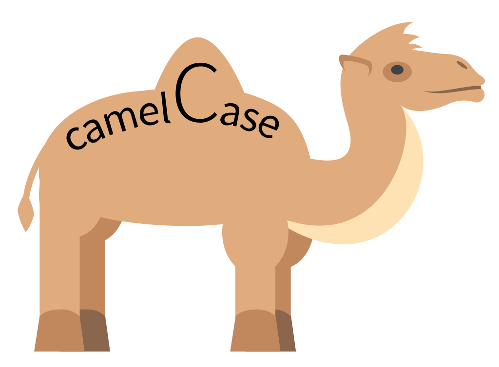

# camelCase



Fuente: en.wikipedia.org/wiki/Camel_case

En algunos lenguajes, es común usar camel case (también conocido como "mixed case") para los nombres de variables cuando esos nombres comprenden múltiples palabras, donde la primera letra de la primera palabra está en minúscula, pero la primera letra de cada palabra subsiguiente está en mayúscula. Por ejemplo, mientras que una variable para el nombre de un usuario podría llamarse name, una variable para el primer nombre de un usuario podría llamarse firstName, y una variable para el nombre preferido del usuario (por ejemplo, un apodo) podría llamarse preferredFirstName.

Python, por el contrario, recomienda snake case, donde las palabras están separadas por guiones bajos (\_), con todas las letras en minúscula. Por ejemplo, esas mismas variables se llamarían name, first_name y preferred_first_name, respectivamente, en Python.

En un archivo llamado camel.py, implementa un programa que solicite al usuario el nombre de una variable en camel case y muestre el nombre correspondiente en snake case. Supón que la entrada del usuario estará efectivamente en camel case.

## Pistas

Recuerda que una cadena (str) tiene bastantes métodos, según docs.python.org/3/library/stdtypes.html#string-methods.
Al igual que una lista, una cadena es "iterable", lo que significa que puedes iterar sobre cada uno de sus caracteres en un bucle. Por ejemplo, si s es una cadena, podrías imprimir cada uno de sus caracteres, uno a la vez, con un código como:

```python
for c in s:
    print(c, end="")
```

## Antes de Comenzar

Inicia sesión en cs50.dev, haz clic en tu ventana de terminal y ejecuta `cd` por sí solo. Deberías ver que el indicador de la ventana de tu terminal se asemeja a lo siguiente:

```bash
$
```

Luego ejecuta

```bash
mkdir camel
```

para crear una carpeta llamada camel en tu espacio de código.

Luego ejecuta

```bash
cd camel
```

para cambiar de directorio a esa carpeta. Ahora deberías ver el indicador de tu terminal como camel/ $. Ahora puedes ejecutar

```bash
code camel.py
```

para crear un archivo llamado camel.py donde escribirás tu programa.

## Cómo Probar

Así es como puedes probar tu código manualmente:

Ejecuta tu programa con

```bash
python camel.py
```

Escribe name y presiona Enter. Tu programa debería mostrar:

```bash
name
```

Ejecuta tu programa con

```bash
python camel.py
```

Escribe firstName y presiona Enter. Tu programa debería mostrar:

```bash
first_name
```

Ejecuta tu programa con

```bash
python camel.py
```

Escribe preferredFirstName y presiona Enter. Tu programa debería mostrar:

```bash
preferred_first_name
```

Puedes ejecutar lo siguiente para verificar tu código usando check50, un programa que CS50 usará para probar tu código cuando lo envíes. ¡Pero asegúrate de probarlo tú mismo también!

```bash
check50 cs50/problems/2022/python/camel
```

Las caritas verdes significan que tu programa ha pasado una prueba. Las caritas rojas indicarán que tu programa mostró algo inesperado. Visita la URL que check50 te proporciona para ver la entrada que check50 entregó a tu programa, qué salida esperaba y qué salida dio tu programa realmente.

## Cómo Enviar

En tu terminal, ejecuta lo siguiente para enviar tu trabajo.

```bash
submit50 cs50/problems/2022/python/camel
```
