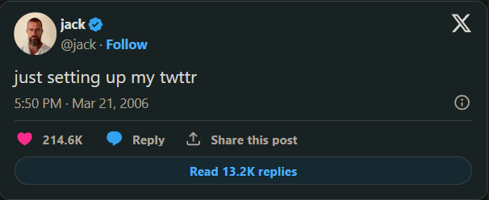

# Just Setting Up my Twttr



Al enviar mensajes de texto o tuitear, no es raro abreviar palabras para ahorrar tiempo o espacio, como omitir vocales, al igual que Twitter originalmente se llamaba twttr. En un archivo llamado twttr.py, implementa un programa que solicite al usuario una cadena de texto y luego muestre ese mismo texto pero con todas las vocales (A, E, I, O y U) omitidas, ya sea en mayúsculas o minúsculas.

### Pistas

Recuerda que una cadena (str) tiene bastantes métodos, según docs.python.org/3/library/stdtypes.html#string-methods.
Al igual que una lista, una cadena es "iterable," lo que significa que puedes iterar sobre cada uno de sus caracteres en un bucle. Por ejemplo, si s es una cadena, podrías imprimir cada uno de sus caracteres, uno a la vez, con un código como:

```python
for c in s:
    print(c, end="")
```

## Antes de Comenzar

Inicia sesión en cs50.dev, haz clic en tu ventana de terminal y ejecuta `cd` por sí solo. Deberías ver que el indicador de la ventana de tu terminal se asemeja a lo siguiente:

```bash
$
```

Luego ejecuta

```bash
mkdir twttr
```

para crear una carpeta llamada twttr en tu espacio de código.

Luego ejecuta

```bash
cd twttr
```

para cambiar de directorio a esa carpeta. Ahora deberías ver el indicador de tu terminal como twttr/ $. Ahora puedes ejecutar

```bash
code twttr.py
```

para crear un archivo llamado twttr.py donde escribirás tu programa.

## Cómo Probar

Así es como puedes probar tu código manualmente:

Ejecuta tu programa con

```bash
python twttr.py
```

Escribe Twitter y presiona Enter. Tu programa debería mostrar:

```bash
Twttr
```

Ejecuta tu programa con

```bash
python twttr.py
```

Escribe What's your name? y presiona Enter. Tu programa debería mostrar:

```bash
Wht's yr nm?
```

Ejecuta tu programa con

```bash
python twttr.py
```

Escribe CS50 y presiona Enter. Tu programa debería mostrar:

```bash
CS50
```

Puedes ejecutar lo siguiente para verificar tu código usando check50, un programa que CS50 usará para probar tu código cuando lo envíes. ¡Pero asegúrate de probarlo tú mismo también!

```bash
check50 cs50/problems/2022/python/twttr
```

Las caritas verdes significan que tu programa ha pasado una prueba. Las caritas rojas indicarán que tu programa mostró algo inesperado. Visita la URL que check50 te proporciona para ver la entrada que check50 entregó a tu programa, qué salida esperaba y qué salida dio tu programa realmente.

Cómo Enviar
En tu terminal, ejecuta lo siguiente para enviar tu trabajo.

```bash
submit50 cs50/problems/2022/python/twttr
```
