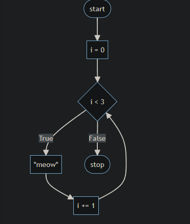
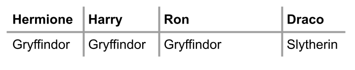
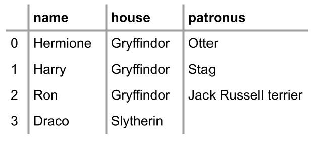
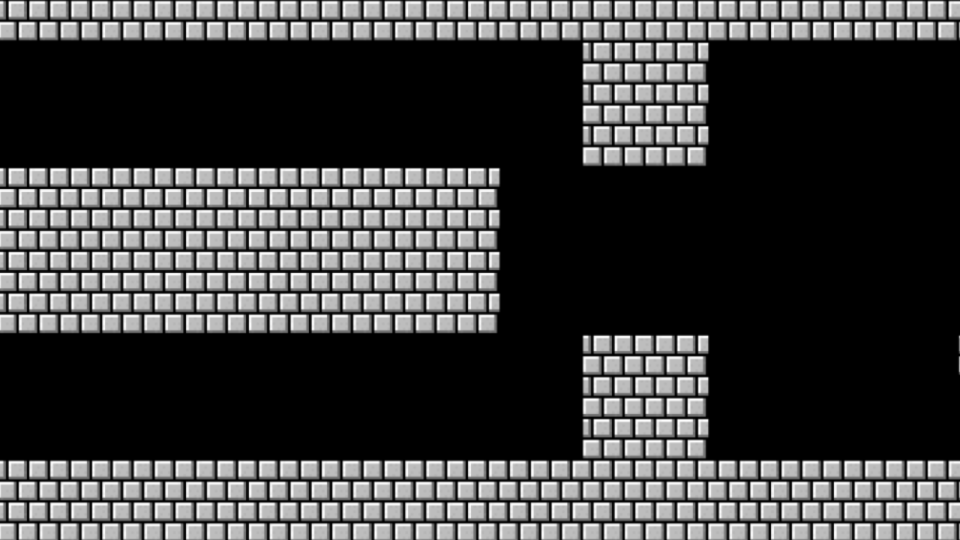

# Lección 2

- Bucles
- While Loops
- For Loops
- Mejorando con la Entrada del Usuario
- Más Sobre Listas
- Longitud
- Diccionarios
- Mario
- Resumiendo

## Bucles

Esencialmente, los bucles son una forma de hacer algo una y otra vez.
Comienza escribiendo `code cat.py` en la ventana de terminal.
En el editor de texto, comienza con el siguiente código:

```python
print("meow")
print("meow")
print("meow")
```

Ejecutando este código escribiendo `python cat.py`, notarás que el programa maúlla tres veces.

Al desarrollarte como programador, debes considerar cómo podrías mejorar las áreas de tu código donde escribes lo mismo una y otra vez. Imagina que quisieras maullar 500 veces. ¿Sería lógico escribir esa misma expresión de `print("meow")` una y otra vez?
Los bucles te permiten crear un bloque de código que se ejecuta una y otra vez.

## While Loops

El bucle while es casi universal en todos los lenguajes de programación.
Dicho bucle repetirá un bloque de código una y otra vez.
En la ventana del editor de texto, edita tu código de la siguiente manera:

```python
i = 3
while i != 0:
    print("meow")
```

Observa que aunque este código ejecutará `print("meow")` varias veces, ¡nunca se detendrá! ¡Bucle infinito! Los bucles while funcionan al preguntar repetidamente si la condición del bucle se ha cumplido. En este caso, el compilador pregunta: "¿i no es igual a cero?" Cuando te quedas atascado en un bucle que se ejecuta para siempre, puedes presionar control-c en tu teclado para salir del bucle.

Para arreglar este bucle que dura para siempre, podemos editar nuestro código de la siguiente manera:

```python
i = 3
while i != 0:
    print("meow")
    i = i - 1
```

Observa que ahora nuestro código se ejecuta correctamente, reduciendo i en 1 para cada “iteración” a través del bucle. El término iteración tiene un significado especial dentro de la programación. Por iteración, nos referimos a un ciclo a través del bucle. La primera iteración es la “0ª” iteración a través del bucle. La segunda es la “1ª” iteración. En programación, contamos empezando con 0, luego 1, luego 2.

Podemos mejorar aún más nuestro código de la siguiente manera:

```python
i = 1
while i <= 3:
    print("meow")
    i = i + 1
```

Observa que cuando codificamos `i = i + 1` asignamos el valor de i de derecha a izquierda. Arriba, estamos comenzando i en uno, como la mayoría de los humanos cuentan (1, 2, 3). Si ejecutas el código anterior, verás que maúlla tres veces. Es una mejor práctica en programación comenzar contando con cero.

Podemos mejorar nuestro código para comenzar contando con cero:

```python
i = 0
while i < 3:
    print("meow")
    i += 1
```

Observa cómo cambiar el operador a `i < 3` permite que nuestro código funcione como se pretende. Comenzamos contando con 0 y itera a través de nuestro bucle tres veces, produciendo tres maullidos. También, observa cómo `i += 1` es lo mismo que decir `i = i + 1`.

Nuestro código en este punto se ilustra de la siguiente manera:



Observa cómo nuestro bucle cuenta i hasta, pero no a través de 3.

## For Loops

Un bucle for es un tipo diferente de bucle.
Para entender mejor un bucle for, es mejor comenzar hablando de un nuevo tipo de variable llamado lista en Python. Como en otras áreas de nuestras vidas, podemos tener una lista de compras, una lista de tareas, etc.
Un bucle for itera a través de una lista de elementos. Por ejemplo, en la ventana del editor de texto, modifica tu código cat.py de la siguiente manera:

```python
for i in [0, 1, 2]:
    print("meow")
```

Observa lo limpio que es este código en comparación con tu código de bucle while anterior. En este código, i comienza con 0, maúlla, i se asigna a 1, maúlla, y, finalmente, i se asigna a 2, maúlla y luego termina.

Aunque este código logra lo que queremos, hay algunas posibilidades de mejorar nuestro código para casos extremos. A primera vista, nuestro código se ve genial. Sin embargo, ¿qué pasaría si quisieras iterar hasta un millón? Es mejor crear un código que pueda funcionar con tales casos extremos. Por lo tanto, podemos mejorar nuestro código de la siguiente manera:

```python
for i in range(3):
    print("meow")
```

Observa cómo `range(3)` proporciona tres valores (0, 1 y 2) automáticamente. Este código se ejecutará y producirá el efecto deseado, maullando tres veces.

Nuestro código puede mejorarse aún más. Observa cómo nunca usamos i explícitamente en nuestro código. Es decir, aunque Python necesita la i como un lugar para almacenar el número de la iteración del bucle, nunca lo usamos para ningún otro propósito. En Python, si tal variable no tiene ningún otro significado en nuestro código, podemos simplemente representar esta variable como un solo guion bajo \_. Por lo tanto, puedes modificar tu código de la siguiente manera:

```python
for _ in range(3):
    print("meow")
```

Observa cómo cambiar la i a \_ no tiene ningún impacto en el funcionamiento de nuestro programa.

Nuestro código puede mejorarse aún más. Para ampliar tu mente a las posibilidades dentro de Python, considera el siguiente código:

```python
print("meow" * 3)
```

Observa cómo maullará tres veces, pero el programa producirá meowmeowmeow como resultado. Considera: ¿Cómo podrías crear un salto de línea al final de cada maullido?

De hecho, puedes editar tu código de la siguiente manera:

```python
print("meow\n" * 3, end="")
```

Observa cómo este código produce tres maullidos, cada uno en una línea separada. Al agregar `end=""` y el `\n` le decimos al compilador que agregue un salto de línea al final de cada maullido.

## Mejorando con la Entrada del Usuario

Quizás queramos obtener la entrada de nuestro usuario. Podemos usar bucles como una forma de validar la entrada del usuario.
Un paradigma común dentro de Python es usar un bucle while para validar la entrada del usuario.
Por ejemplo, intentemos pedirle al usuario un número mayor o igual a 0:

```python
while True:
    n = int(input("What's n? "))
    if n < 0:
        continue
    else:
        break
```

Observa que hemos introducido dos nuevas palabras clave en Python, `continue` y `break`. `continue` le dice explícitamente a Python que pase a la siguiente iteración de un bucle. `break`, por otro lado, le dice a Python que "salga" de un bucle antes de que haya terminado todas sus iteraciones. En este caso, continuaremos a la siguiente iteración del bucle cuando n sea menor que 0, lo que en última instancia volverá a pedir al usuario con “What’s n?”. Sin embargo, si n es mayor o igual a 0, saldremos del bucle y permitiremos que el resto de nuestro programa se ejecute.
Resulta que la palabra clave `continue` es redundante en este caso. Podemos mejorar nuestro código de la siguiente manera:

```python
while True:
    n = int(input("What's n? "))
    if n > 0:
        break

for _ in range(n):
    print("meow")
```

Observa cómo este bucle while siempre se ejecutará (para siempre) hasta que n sea mayor que 0. Cuando n sea mayor que 0, el bucle se rompe.

Trayendo nuestro aprendizaje previo, podemos usar funciones para mejorar aún más nuestro código:

```python
def main():
    meow(get_number())


def get_number():
    while True:
        n = int(input("What's n? "))
        if n > 1:
            return n


def meow(n):
    for _ in range(n):
        print("meow")


main()
```

Observa cómo no solo cambiamos tu código para operar en múltiples funciones, sino que también usamos una declaración return para devolver el valor de n a la función principal.

## Más Sobre Listas

Considera el mundo de Hogwarts del famoso universo de Harry Potter.
En la terminal, escribe `code hogwarts.py`.
En el editor de texto, codifica lo siguiente:

```python
students = ["Hermione", "Harry", "Ron"]

print(students[0])
print(students[1])
print(students[2])
```

Observa cómo tenemos una lista de estudiantes con sus nombres como se muestra arriba. Luego imprimimos al estudiante que está en la ubicación 0, “Hermione”. Cada uno de los otros estudiantes también se imprime.

Así como lo ilustramos anteriormente, podemos usar un bucle para iterar sobre la lista. Puedes mejorar tu código de la siguiente manera:

```python
students = ["Hermione", "Harry", "Ron"]

for student in students:
    print(student)
```

Observa que para cada estudiante

en la lista de students, imprimirá al estudiante como se pretende. Podrías preguntarte por qué no usamos la designación \_ como se discutió anteriormente. Elegimos no hacerlo porque student se usa explícitamente en nuestro código.

Puedes aprender más en la documentación de Python sobre listas.

## Longitud / Length

Podemos utilizar `len` como una forma de verificar la longitud de la lista llamada students.
Imagina que no solo quieres imprimir el nombre del estudiante, sino también su posición en la lista. Para lograr esto, puedes editar tu código de la siguiente manera:

```python
students = ["Hermione", "Harry", "Ron"]

for i in range(len(students)):
    print(i + 1, students[i])
```

Observa cómo al ejecutar este código no solo obtenemos la posición de cada estudiante más uno usando `i + 1`, sino que también imprimimos el nombre de cada estudiante. `len` te permite ver dinámicamente cuán larga es la lista de estudiantes, sin importar cuánto crezca.

Puedes aprender más en la documentación de Python sobre `len`.

## Diccionarios

`dicts` o diccionarios son una estructura de datos que te permite asociar claves con valores.
Donde una lista es una lista de múltiples valores, un `dict` asocia una clave con un valor.
Considerando las casas de Hogwarts, podríamos asignar estudiantes específicos a casas específicas.

Nombres de Harry Potter.



Podríamos usar solo listas para lograr esto:

```python
students = ["Hermione", "Harry", "Ron", "Draco"]
houses = ["Gryffindor", "Gryffindor", "Gryffindor", "Slytherin"]
```

Observa que podemos prometer que siempre mantendremos estas listas en orden. El individuo en la primera posición de students está asociado con la casa en la primera posición de la lista houses, y así sucesivamente. Sin embargo, esto puede volverse bastante engorroso a medida que nuestras listas crecen.

Podemos mejorar nuestro código usando un `dict` de la siguiente manera:

```python
students = {
    "Hermione": "Gryffindor",
    "Harry": "Gryffindor",
    "Ron": "Gryffindor",
    "Draco": "Slytherin",
}
print(students["Hermione"])
print(students["Harry"])
print(students["Ron"])
print(students["Draco"])
```

Observa cómo usamos {} llaves para crear un diccionario. Donde las listas usan números para iterar a través de la lista, los `dicts` nos permiten usar palabras.

Ejecuta tu código y asegúrate de que tu salida sea la siguiente:

```bash
$ python hogwarts.py
Gryffindor
Gryffindor
Gryffindor
Slytherin
```

Podemos mejorar nuestro código de la siguiente manera:

```python
students = {
    "Hermione": "Gryffindor",
    "Harry": "Gryffindor",
    "Ron": "Gryffindor",
    "Draco": "Slytherin",
}
for student in students:
    print(student)
```

Observa cómo, al ejecutar este código, el bucle `for` solo iterará a través de todas las claves, resultando en una lista de los nombres de los estudiantes. ¿Cómo podríamos imprimir tanto los valores como las claves?

Modifica tu código de la siguiente manera:

```python
students = {
    "Hermione": "Gryffindor",
    "Harry": "Gryffindor",
    "Ron": "Gryffindor",
    "Draco": "Slytherin",
}
for student in students:
    print(student, students[student])
```

Observa cómo `students[student]` irá a la clave de cada estudiante y encontrará el valor de su casa. Ejecuta tu código y notarás que la salida es un poco desordenada.

Podemos limpiar la función `print` mejorando nuestro código de la siguiente manera:

```python
students = {
    "Hermione": "Gryffindor",
    "Harry": "Gryffindor",
    "Ron": "Gryffindor",
    "Draco": "Slytherin",
}
for student in students:
    print(student, students[student], sep=", ")
```

Observa cómo esto crea una separación limpia de una coma `,` entre cada elemento impreso.

Si ejecutas `python hogwarts.py`, deberías ver lo siguiente:

```bash
$ python hogwarts.py
Hermione, Gryffindor
Harry, Gryffindor
Ron, Gryffindor
Draco, Slytherin
```

¿Qué pasa si tenemos más información sobre nuestros estudiantes? ¿Cómo podríamos asociar más datos con cada uno de los estudiantes?



Puedes imaginar querer tener muchos datos asociados con múltiples claves. Mejora tu código de la siguiente manera:

```python
students = [
    {"name": "Hermione", "house": "Gryffindor", "patronus": "Otter"},
    {"name": "Harry", "house": "Gryffindor", "patronus": "Stag"},
    {"name": "Ron", "house": "Gryffindor", "patronus": "Jack Russell terrier"},
    {"name": "Draco", "house": "Slytherin", "patronus": None},
]
```

Observa cómo este código crea una lista de `dicts`. La lista llamada students tiene cuatro `dicts` dentro de ella: uno para cada estudiante. Además, observa que Python tiene una designación especial `None` donde no hay ningún valor asociado con una clave.

Ahora, tienes acceso a una gran cantidad de datos interesantes sobre estos estudiantes. Ahora, modifica aún más tu código de la siguiente manera:

```python
students = [
    {"name": "Hermione", "house": "Gryffindor", "patronus": "Otter"},
    {"name": "Harry", "house": "Gryffindor", "patronus": "Stag"},
    {"name": "Ron", "house": "Gryffindor", "patronus": "Jack Russell terrier"},
    {"name": "Draco", "house": "Slytherin", "patronus": None},
]

for student in students:
    print(student["name"], student["house"], student["patronus"], sep=", ")
```

Observa cómo el bucle `for` iterará a través de cada uno de los `dicts` dentro de la lista llamada students.

Puedes aprender más en la Documentación de Python sobre `dicts`.

## Mario

Recuerda que el juego clásico Mario tiene un héroe que salta sobre ladrillos. Vamos a crear una representación textual de este juego.


Comienza codificando lo siguiente:

```python
print("#")
print("#")
print("#")
```

Observa cómo estamos copiando y pegando el mismo código una y otra vez.

Considera cómo podríamos mejorar el código de la siguiente manera:

```python
for _ in range(3):
    print("#")
```

Observa cómo esto logra esencialmente lo que queremos crear.

Considera: ¿Podríamos abstraer aún más para resolver problemas más sofisticados más adelante con este código? Modifica tu código de la siguiente manera:

```python
def main():
    print_column(3)


def print_column(height):
    for _ in range(height):
        print("#")


main()
```

Observa cómo nuestra columna puede crecer tanto como queramos sin ningún código rígido.

Ahora, intentemos imprimir una fila horizontalmente. Modifica tu código de la siguiente manera:

```python
def main():
    print_row(4)


def print_row(width):
    print("?" * width)


main()
```

Observa cómo ahora tenemos un código que puede crear bloques de izquierda a derecha.

Examinando la diapositiva a continuación, observa cómo Mario tiene filas y columnas de bloques.



Considera: ¿Cómo podríamos implementar tanto filas como columnas dentro de nuestro código? Modifica tu código de la siguiente manera:

```python
def main():
    print_square(3)


def print_square(size):

    # Para cada fila en el cuadrado
    for i in range(size):

        # Para cada ladrillo en la fila
        for j in range(size):

            # Imprimir ladrillo
            print("#", end="")

        # Imprimir línea en blanco
        print()


main()
```

Observa que tenemos un bucle externo que se ocupa de cada fila en el cuadrado. Luego, tenemos un bucle interno que imprime un ladrillo en cada fila. Finalmente, tenemos una declaración print que imprime una línea en blanco.

Podemos abstraer aún más nuestro código:

```python
def main():
    print_square(3)


def print_square(size):
    for i in range(size):
        print_row(size)


def print_row(width):
    print("#" * width)


main()
```

Resumiendo
Ahora tienes otro poder en tu creciente lista de habilidades en Python. En esta lección, abordamos…

Bucles
while
for
len
lista
dict
